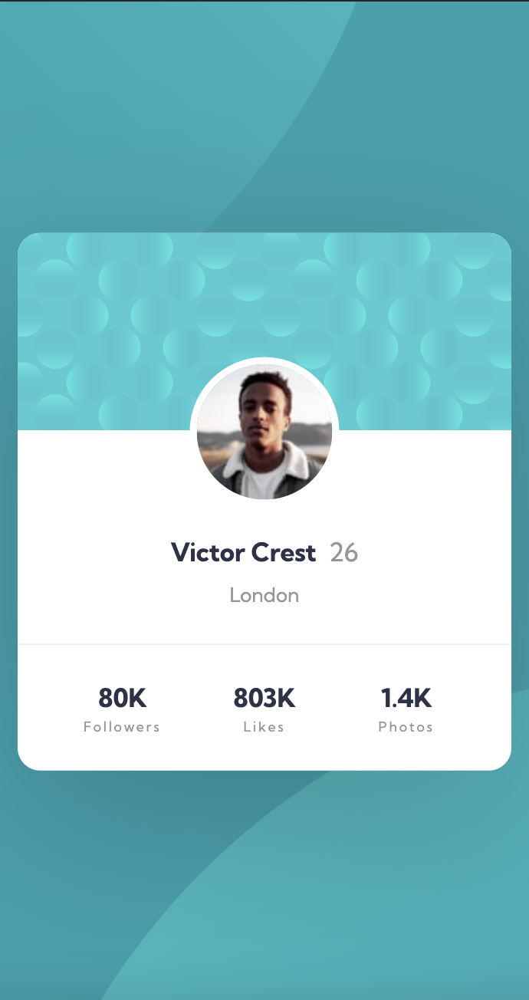
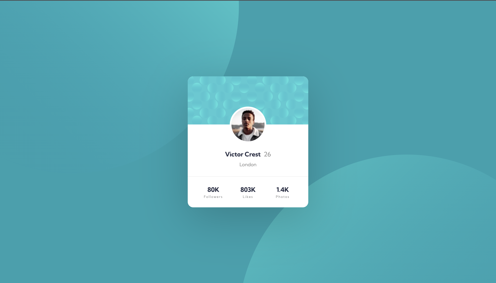

# Frontend Mentor - Profile card component solution

This is a solution to the [Profile card component challenge on Frontend Mentor](https://www.frontendmentor.io/challenges/profile-card-component-cfArpWshJ). Frontend Mentor challenges help you improve your coding skills by building realistic projects.

## Table of contents

- [Overview](#overview)
  - [The challenge](#the-challenge)
  - [Screenshot](#screenshot)
    - [Mobile](#mobile)
    - [Desktop](#desktop)
  - [Links](#links)
- [My process](#my-process)
  - [Built with](#built-with)
- [Author](#author)
- [Acknowledgments](#acknowledgments)

## Overview

### The challenge

- Build out the project to the designs provided

### Screenshot

#### Mobile

#### Desktop

### Links

- Solution URL: [Add solution URL here](https://your-solution-url.com)
- Live Site URL: [Add live site URL here](https://your-live-site-url.com)

## My process

### Built with

- Semantic HTML5 markup
- CSS custom properties
- Flexbox
- Mobile-first workflow

## Author

- Website - [Wessel Konstantinov](https://github.com/WesselKonstantinov)
- Frontend Mentor - [@WesselKonstantinov](https://www.frontendmentor.io/profile/WesselKonstantinov)

## Acknowledgments

Credits to [ApplePieGiraffe](https://www.frontendmentor.io/profile/ApplePieGiraffe), whose solution I used in order to style the background.
